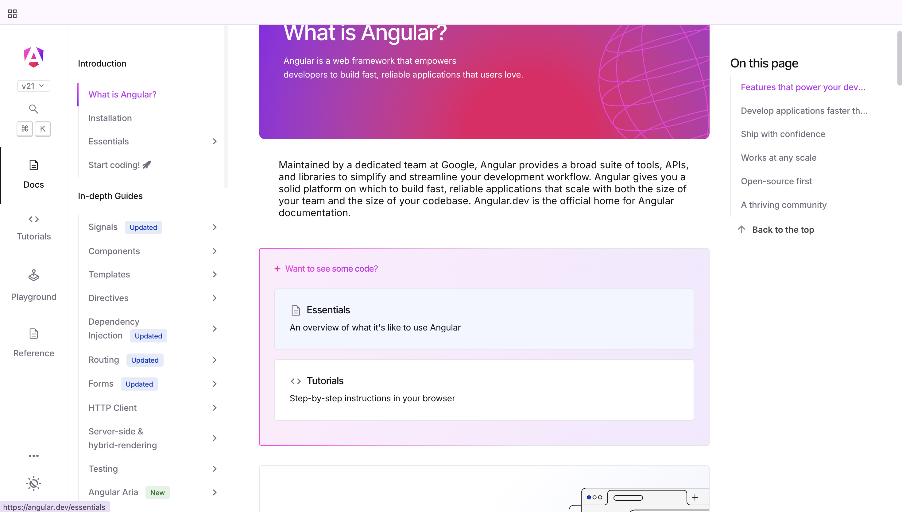
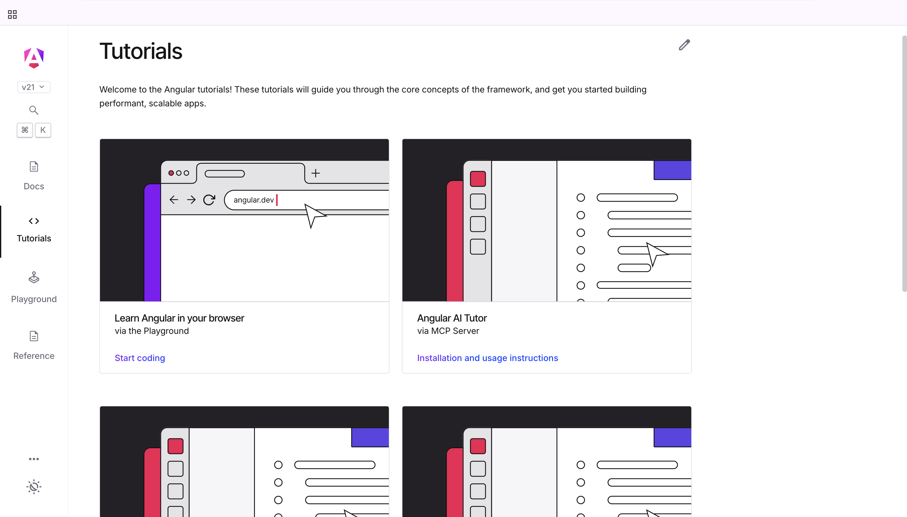
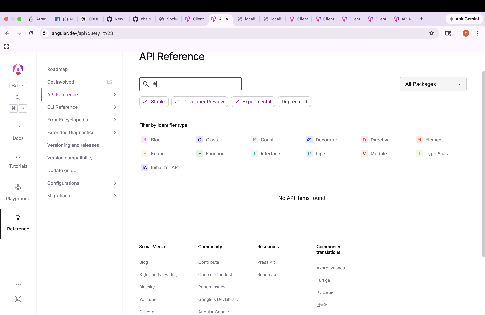

# 🚀 Real-Time Social Media App

A full-stack real-time social media application built using **Angular**, **Node.js**, and **Socket.IO**.

---

## 📸 Screenshots

---

## ✨ Features

- ⚡ Real-time updates using Socket.IO
- 📝 Create and view posts
- 🌐 Full-stack architecture
- 📡 REST API integration
- 📱 Responsive frontend (Angular)

---

## 🛠️ Tech Stack

### Frontend:

- Angular
- TypeScript
- HTML, CSS

### Backend:

- Node.js
- Express.js
- Socket.IO

---

## 📁 Project Structure

real-time-social-media-app/
│
├── client/
├── server/
├── screenshots/
└── README.md

---

## 🚀 How to Run Locally

### 1️⃣ Clone the repo

git clone https://github.com/chaitragorla/real-time-social-media-app.git

cd real-time-social-media-app

### 2️⃣ Run Backend

cd server
npm install
npm run dev

👉 Runs on: http://localhost:3000

### 3️⃣ Run Frontend

cd client
npm install
ng serve --open

👉 Runs on: http://localhost:4200

---

## 📈 Future Improvements

- 🔐 Authentication (JWT)
- ❤️ Likes & Comments
- 🖼️ Image Uploads
- 👤 Profile Pages
- 🔔 Notifications

---

## 👨‍💻 Author

**Chaitra Gorla**  
GitHub: https://github.com/chaitragorla
